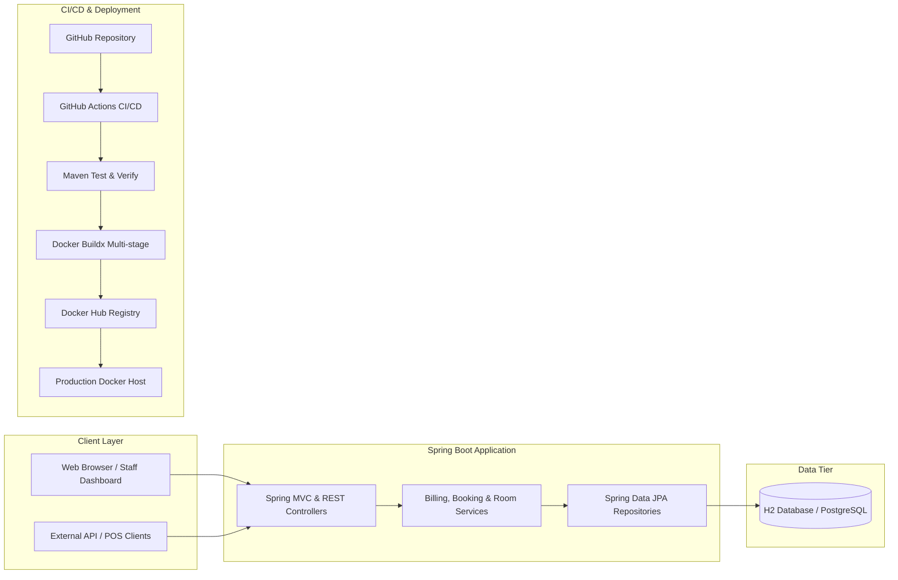

# 🏨 Grand Horizon - Hotel Billing & Management System

[](https://spring.io/projects/spring-boot)
[](https://www.oracle.com/java/)
[](https://www.docker.com/)
[](https://github.com/features/actions)
[](LICENSE)

A containerized, production-ready **Hotel Billing and Management System** built with **Spring Boot 3**, **Spring Data JPA**, **Thymeleaf**, and **Docker**. Automated with a **GitHub Actions CI/CD pipeline** that runs automated unit/integration tests with Maven, builds multi-stage Docker images, applies `latest` and Git commit SHA tags, and pushes images directly to Docker Hub upon every push to the `main` branch.

---

## 📑 Table of Contents

- [Key Features](#-key-features)
- [System Architecture](#-system-architecture)
- [Tech Stack](#-tech-stack)
- [Project Directory Structure](#-project-directory-structure)
- [Getting Started Locally](#-getting-started-locally)
- [Containerization with Docker](#-containerization-with-docker)
  - [Build and Run with Docker](#1-build-and-run-with-docker)
  - [Run with Docker Compose](#2-run-with-docker-compose-spring-boot--postgresql)
- [GitHub Actions CI/CD Pipeline](#-github-actions-cicd-pipeline)
  - [Pipeline Flow](#pipeline-flow)
  - [Setting Up Docker Hub Credentials in GitHub Secrets](#setting-up-docker-hub-credentials-in-github-secrets)
- [REST API Reference](#-rest-api-reference)
- [Application Screenshots & UI Flow](#-application-ui-flow)
- [License](#-license)

---

## 🌟 Key Features

### 🛎️ 1. Room & Guest Management
- Inventory of rooms across different tiers (**Standard**, **Deluxe**, **Executive Suite**, **Presidential Penthouse**).
- Real-time room status tracking: `AVAILABLE`, `OCCUPIED`, `CLEANING`, `MAINTENANCE`.
- Guest registration profiles with ID verification (Passport, Driver License, National ID).

### 🧾 2. Dynamic Billing & Folio Engine
- Automatic room charge calculation based on check-in and check-out dates.
- Itemized billing for hotel services (**Room Service Dining**, **Beverages**, **Laundry**, **Spa & Wellness**, **Airport Chauffeur Transfer**).
- Configurable **GST / VAT / Sales Tax** engine (default 12%).
- Promotional and loyalty **Discount percentage** deduction.
- Calculation: $\text{Net Total} = \text{Room Charge} + \text{Services} + \text{Tax} - \text{Discount}$.

### 📄 3. Printable / PDF-Ready Invoices
- Professional tax invoice template with hotel header, itemized breakdown, tax details, payment mode, and authorized signature section.
- Native browser print styling (`@media print`) for 1-click PDF download or physical printing.

### 💳 4. Flexible Settlement & Payment Modes
- Instant checkout payment processing (`CREDIT_CARD`, `CASH`, `UPI`, `NET_BANKING`, `CORPORATE_BILLING`).
- Auto-releases room back to `AVAILABLE` status upon full bill settlement.

### 📊 5. Financial Dashboard & Analytics
- Live metrics for total collected revenue, pending folios, occupancy rate %, and active stays.

---

## 🏗️ System Architecture



---

## 💻 Tech Stack

- **Backend**: Java 17/21, Spring Boot 3.3.3 (Spring MVC, Spring Data JPA, Spring Validation, Actuator)
- **Frontend**: Thymeleaf, Bootstrap 5, FontAwesome 6, Chart.js, HTML5, Vanilla JavaScript
- **Database**: H2 Database (in-memory dev/test) / PostgreSQL 16 (production container)
- **Containerization**: Docker (multi-stage build), Docker Compose
- **CI/CD Pipeline**: GitHub Actions (`actions/checkout@v4`, `actions/setup-java@v4`, `docker/build-push-action@v5`)
- **Testing**: JUnit 5, Mockito, AssertJ, Spring Boot Test (`MockMvc`)

---

## 📂 Project Directory Structure

```text
hotel-billing-system/
├── .github/
│   └── workflows/
│       └── ci-cd.yml                 # GitHub Actions CI/CD pipeline definition
├── src/
│   ├── main/
│   │   ├── java/com/hotel/billing/
│   │   │   ├── HotelBillingApplication.java
│   │   │   ├── config/
│   │   │   │   └── DataInitializer.java        # Seeds initial rooms, services & stays
│   │   │   ├── controller/
│   │   │   │   ├── WebController.java          # Thymeleaf web routing
│   │   │   │   ├── BillApiController.java      # REST API for billing
│   │   │   │   ├── BookingApiController.java   # REST API for bookings
│   │   │   │   ├── RoomApiController.java      # REST API for rooms
│   │   │   │   └── StatsApiController.java     # REST API for analytics
│   │   │   ├── dto/
│   │   │   │   ├── BillRequestDto.java
│   │   │   │   ├── BillItemDto.java
│   │   │   │   ├── PaymentRequestDto.java
│   │   │   │   ├── BookingRequestDto.java
│   │   │   │   ├── RoomRequestDto.java
│   │   │   │   └── DashboardStatsDto.java
│   │   │   ├── model/
│   │   │   │   ├── Bill.java                   # Invoice & billing entity
│   │   │   │   ├── BillItem.java               # Line item entity
│   │   │   │   ├── Booking.java                # Guest stay entity
│   │   │   │   ├── Guest.java                  # Guest profile entity
│   │   │   │   ├── Room.java                   # Room entity
│   │   │   │   ├── HotelServiceItem.java       # Chargeable service catalog
│   │   │   │   └── *.java                      # Enums (RoomType, PaymentStatus, etc.)
│   │   │   ├── repository/                     # JPA repositories
│   │   │   └── service/                        # Core business logic services
│   │   └── resources/
│   │       ├── application.yml                 # Application configuration
│   │       ├── static/
│   │       │   ├── css/custom.css              # Custom styling & print layout
│   │       │   └── js/app.js                   # Interactive UI AJAX scripts
│   │       └── templates/
│   │           ├── index.html                  # Dashboard view
│   │           ├── billing.html                # Billing Folio management view
│   │           ├── invoice.html                # Printable tax invoice view
│   │           ├── rooms.html                  # Room inventory view
│   │           └── bookings.html               # Reservations view
│   └── test/
│       └── java/com/hotel/billing/
│           ├── HotelBillingApplicationTests.java
│           ├── controller/BillApiControllerTest.java
│           └── service/BillingServiceTest.java
├── Dockerfile                                  # Multi-stage production container build
├── .dockerignore                               # Files excluded from Docker build context
├── docker-compose.yml                          # Multi-container orchestration (App + Postgres)
├── pom.xml                                     # Maven dependency & build descriptor
└── README.md                                   # Comprehensive documentation
```

---

## 🚀 Getting Started Locally

### Prerequisites
- **JDK 17** or **JDK 21** installed
- **Apache Maven 3.8+** installed

### 1. Run with Maven
```bash
# Clone the repository
git clone https://github.com/<your-username>/hotel-billing-system.git
cd hotel-billing-system

# Run tests and start application
mvn spring-boot:run
```

Once started, access the application in your browser:
- **Web Dashboard**: [http://localhost:8080/](http://localhost:8080/)
- **Billing Center**: [http://localhost:8080/billing](http://localhost:8080/billing)
- **H2 Database Console**: [http://localhost:8080/h2-console](http://localhost:8080/h2-console) (JDBC URL: `jdbc:h2:mem:hoteldb`, User: `sa`, Password: *blank*)
- **Health Actuator**: [http://localhost:8080/actuator/health](http://localhost:8080/actuator/health)

---

## 🐳 Containerization with Docker

### 1. Build and Run with Docker

Build the optimized multi-stage container image:
```bash
docker build -t hotel-billing-system:latest .
```

Run the container:
```bash
docker run -d \
  --name hotel-billing-app \
  -p 8080:8080 \
  hotel-billing-system:latest
```

Verify container health:
```bash
docker ps
curl http://localhost:8080/actuator/health
```

### 2. Run with Docker Compose (Spring Boot + PostgreSQL)
Run the entire production stack (Spring Boot Application + PostgreSQL 16 database):
```bash
docker-compose up -d --build
```

To stop the services:
```bash
docker-compose down
```

---

## 🔄 GitHub Actions CI/CD Pipeline

The repository contains a fully automated CI/CD pipeline defined in [`.github/workflows/ci-cd.yml`](.github/workflows/ci-cd.yml).

### Pipeline Flow

```text
┌─────────────────────────┐
│ Git Push to main Branch │
└───────────┬─────────────┘
            │
            ▼
┌─────────────────────────┐
│ 🧪 Maven Test & Verify  │──► Compiles code & runs JUnit 5 test suite
└───────────┬─────────────┘
            │ (Pass)
            ▼
┌─────────────────────────┐
│ 🔑 Docker Hub Login     │──► Authenticates using GitHub Repository Secrets
└───────────┬─────────────┘
            │
            ▼
┌─────────────────────────┐
│ 🐳 Docker Buildx Build  │──► Builds multi-stage image with GHA caching
└───────────┬─────────────┘
            │
            ▼
┌─────────────────────────┐
│ 🏷️ Apply Tags           │──► Tags: 'latest' & 'sha-<commit-sha>'
└───────────┬─────────────┘
            │
            ▼
┌─────────────────────────┐
│ 🚀 Push to Docker Hub   │──► Publishes to <username>/hotel-billing-system
└───────────┬─────────────┘
            │
            ▼
┌─────────────────────────┐
│ 📋 Step Summary Report  │──► Generates detailed build summary in GitHub UI
└─────────────────────────┘
```

### Setting Up Docker Hub Credentials in GitHub Secrets

To enable the pipeline to push Docker images to your Docker Hub repository:

1. **Generate Docker Hub Access Token**:
   - Log in to [Docker Hub](https://hub.docker.com/).
   - Click your profile icon $\rightarrow$ **Account Settings** $\rightarrow$ **Security** $\rightarrow$ **New Access Token**.
   - Set description to `github-actions-hotel-billing` and permissions to **Read, Write, Delete**.
   - Copy the generated Access Token.

2. **Add Secrets to GitHub Repository**:
   - Navigate to your GitHub repository $\rightarrow$ **Settings** $\rightarrow$ **Secrets and variables** $\rightarrow$ **Actions**.
   - Click **New repository secret** and add:
     - Name: `DOCKERHUB_USERNAME` | Value: `<your-dockerhub-username>`
     - Name: `DOCKERHUB_TOKEN` | Value: `<your-dockerhub-access-token>`

3. **Trigger Pipeline**:
   - Push any commit to the `main` branch:
     ```bash
     git add .
     git commit -m "feat: setup hotel billing system with CI/CD"
     git push origin main
     ```
   - Watch the workflow execute in the **Actions** tab of your repository.

---

## 📡 REST API Reference

| Method | Endpoint | Description |
| :--- | :--- | :--- |
| `GET` | `/api/v1/bills` | List all billing folios |
| `GET` | `/api/v1/bills/recent` | List 10 most recent bills |
| `GET` | `/api/v1/bills/{id}` | Get bill details by ID |
| `GET` | `/api/v1/bills/invoice/{invNo}` | Get bill details by Invoice Number |
| `POST` | `/api/v1/bills/generate` | Generate invoice for a booking |
| `POST` | `/api/v1/bills/{id}/pay` | Record payment settlement |
| `GET` | `/api/v1/rooms` | List all rooms |
| `GET` | `/api/v1/rooms/available` | List available rooms |
| `POST` | `/api/v1/rooms` | Add a new room |
| `GET` | `/api/v1/bookings/active` | List active guest stays |
| `POST` | `/api/v1/bookings` | Register guest check-in |
| `GET` | `/api/v1/stats` | Get hotel financial & occupancy KPI metrics |

### Sample JSON: Generate Bill (`POST /api/v1/bills/generate`)
```json
{
  "bookingId": 1,
  "items": [
    {
      "itemName": "Gourmet Breakfast Buffet",
      "category": "ROOM_SERVICE",
      "quantity": 2,
      "unitPrice": 25.00
    },
    {
      "itemName": "VIP Airport Transfer",
      "category": "TRANSPORT",
      "quantity": 1,
      "unitPrice": 75.00
    }
  ],
  "customTaxPercentage": 12.0,
  "discountPercentage": 5.0,
  "paymentStatus": "PAID",
  "paymentMethod": "CREDIT_CARD",
  "paymentTransactionId": "TXN-8839201",
  "notes": "Settled at check-out. VIP member discount applied."
}
```

---

## 🖥️ Application UI Flow

1. **Dashboard (`/`)**: Displays live revenue KPI cards, active check-in list, and quick actions.
2. **Billing Folio (`/billing`)**: Allows staff to pick an active guest, add customized services, adjust tax/discount, calculate instant subtotal, and generate the bill.
3. **Printable Invoice (`/invoice/{id}`)**: Clean, high-resolution tax invoice with 1-click browser printing/PDF export.
4. **Reservations (`/bookings`)**: Manage guest check-ins, ID proofs, room assignment, and check-out dates.
5. **Room Management (`/rooms`)**: Monitor room statuses and tier pricing.

---

## 📄 License

This project is licensed under the MIT License.
